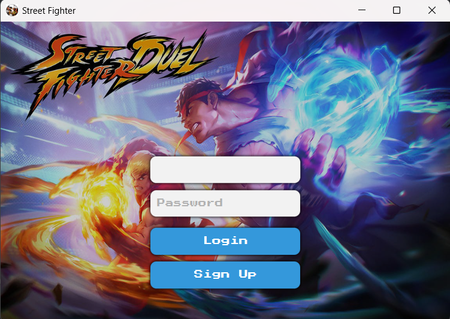
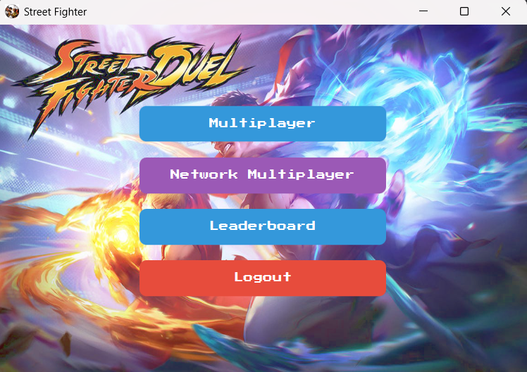
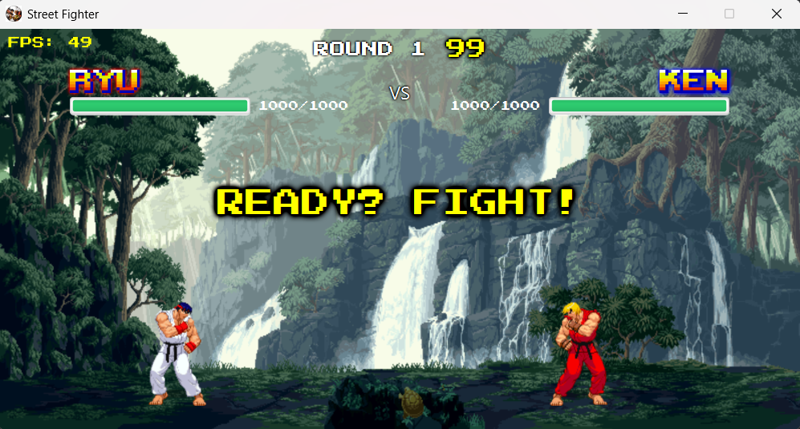

# 🥊 Street Fighter - JavaFX Fighting Game

A fully-featured 2D fighting game inspired by Street Fighter, built with JavaFX. Features both local and online multiplayer with synchronized network gameplay.


## 📸 Screenshots
<p align="center">
  
  
  
  
  
</p>

## ✨ Features

### 🎮 Gameplay
- **Two playable characters**: Ryu and Ken with unique sprites
- **Multiple fighting moves**: Light/Heavy Punches, Light/Heavy Kicks
- **Special mechanics**: Blocking, jumping, crouching
- **Combo system**: Chain attacks for maximum damage
- **Health and timer system**: 99-second rounds
- **Best of 3 matches**: First to 2 wins takes the match

### 🗺️ Game Modes
- **Local Multiplayer**: Play with a friend on the same computer
- **Network Multiplayer**: Host or join games over LAN/Internet
- **Character Selection**: Choose your fighter before battle
- **Map Selection**: Fight across 6 different stages

### 🌐 Network Features
- **UDP-based networking** for low-latency gameplay
- **Host/Client architecture** with automatic synchronization
- **Round state synchronization**: Both players see the same game state
- **Pause/Resume support**: Either player can pause the match
- **Rematch system**: Play multiple matches without reconnecting
- **Connection status indicators**: Real-time network feedback
- **Heartbeat system**: Automatic disconnect detection

### 🎨 Polish
- **Custom pixel art sprites** and animations
- **Smooth animation system** with frame-based rendering
- **Dynamic health bars** with color transitions
- **Background music and sound effects**
- **Custom font rendering**
- **FPS counter** for performance monitoring
- **Pause menu** with controls display

## 🛠️ Technologies Used

- **Java 21**
- **JavaFX 21** - UI framework
- **UDP Sockets** - Network communication
- **ByteBuffer** - Efficient packet serialization
- **ExecutorService** - Concurrent networking
- **AnimationTimer** - Game loop implementation

## 📋 Prerequisites

- Java Development Kit (JDK) 21 or higher
- JavaFX SDK 21
- Maven (for dependency management)
- Minimum 4GB RAM
- Graphics card with OpenGL support

## 🚀 Installation

### 1. Clone the Repository
```bash
git clone https://github.com/yourusername/street-fighter-javafx.git
cd street-fighter-javafx
```

### 2. Install JavaFX
Download JavaFX SDK 21 from [openjfx.io](https://openjfx.io/)

### 3. Configure JavaFX Path
Update your IDE or build configuration with JavaFX library path:
```bash
--module-path /path/to/javafx-sdk-21/lib --add-modules javafx.controls,javafx.fxml,javafx.media
```

### 4. Build the Project
```bash
mvn clean install
```

### 5. Run the Game
```bash
java --module-path /path/to/javafx-sdk-21/lib --add-modules javafx.controls,javafx.fxml,javafx.media -jar target/street-fighter-game.jar
```

## 🎯 How to Play

### Local Multiplayer

**Player 1 Controls:**
- `A` / `D` - Move left/right
- `W` - Jump
- `S` - Crouch
- `J` - Light Punch
- `K` - Heavy Punch
- `U` - Light Kick
- `I` - Heavy Kick
- `L` - Block

**Player 2 Controls:**
- `←` / `→` - Move left/right
- `↑` - Jump
- `↓` - Crouch
- `Numpad 4` - Light Punch
- `Numpad 5` - Heavy Punch
- `Numpad 1` - Light Kick
- `Numpad 2` - Heavy Kick
- `Numpad 6` - Block

**General Controls:**
- `ESC` - Pause/Resume
- `M` - Toggle controls display

### Network Multiplayer

#### Host a Game:
1. Click "Network" from main menu
2. Click "Host Game"
3. Share your IP address with opponent
4. Wait for player 2 to connect
5. Select characters and map
6. Fight!

#### Join a Game:
1. Click "Network" from main menu
2. Enter host's IP address
3. Click "Join Game"
4. Wait for host to select characters
5. Fight!

## 📁 Project Structure

```
street-fighter-javafx/
├── src/
│   ├── main/
│   │   ├── java/
│   │   │   ├── Client/
│   │   │   │   ├── GameSceneController.java    # Main game logic
│   │   │   │   ├── NetworkClient.java          # Client networking
│   │   │   │   ├── Fighter.java                # Character controller
│   │   │   │   ├── InputManager.java           # Input handling
│   │   │   │   ├── AssetManager.java           # Resource loading
│   │   │   │   ├── AudioManager.java           # Sound system
│   │   │   │   ├── CombatSystem.java           # Damage calculation
│   │   │   │   └── ...
│   │   │   └── Server/
│   │   │       └── NetworkGameServer.java      # UDP game server
│   │   └── resources/
│   │       ├── images/                         # Sprites and backgrounds
│   │       ├── sounds/                         # Audio files
│   │       ├── fonts/                          # Custom fonts
│   │       └── com/example/game/              # FXML files
├── pom.xml
└── README.md
```

## 🔧 Configuration

### Network Settings
Edit `NetworkGameServer.java`:
```java
private static final int PORT = 5555;  // Change server port
private static final int TICK_RATE = 60;  // Server update rate
```

### Gameplay Settings
Edit `GameSceneController.java`:
```java
private int roundTimer = 99;  // Round duration in seconds
```

### Character Stats
Edit `Fighter.java`:
```java
private static final int MAX_HEALTH = 1000;
private static final float MOVE_SPEED = 3.0f;
private static final float JUMP_SPEED = 12.0f;
```

## 🐛 Known Issues

- Network gameplay may experience lag on high-latency connections (>100ms)
- Character sprites are limited to Ryu and Ken
- No AI opponent for single-player mode
- Audio may not work on some Linux distributions

## 🗺️ Roadmap

- [ ] Add more playable characters
- [ ] Implement special moves (Hadouken, Shoryuken)
- [ ] Add AI opponent with difficulty levels
- [ ] Create tournament mode
- [ ] Add replay system
- [ ] Implement rollback netcode for better online play
- [ ] Add matchmaking system
- [ ] Create character customization
- [ ] Add training mode

## 🤝 Contributing

Contributions are welcome! Please follow these steps:

1. Fork the repository
2. Create a feature branch (`git checkout -b feature/AmazingFeature`)
3. Commit your changes (`git commit -m 'Add some AmazingFeature'`)
4. Push to the branch (`git push origin feature/AmazingFeature`)
5. Open a Pull Request

### Code Style
- Follow Java naming conventions
- Use meaningful variable names
- Comment complex logic
- Keep methods under 50 lines when possible
- Write clean, readable code

## 📝 License

This project is licensed under the MIT License - see the [LICENSE](LICENSE) file for details.

## 🙏 Acknowledgments

- Inspired by Capcom's Street Fighter series
- Sprite assets from [OpenGameArt](https://opengameart.org/)
- Sound effects from [FreeSound](https://freesound.org/)
- JavaFX community for excellent documentation

## 👨‍💻 Author


- GitHub: [Kabir](https://github.com/daicarus)
- Email: miftahulkabir@gmail.com
- GitHub: [Nihan](https://github.com/Nihan2609)
- Email: extremenihan@gmail.com


## ⭐ Show Your Support

Give a ⭐️ if this project helped you learn game development or JavaFX!

---

**Made with ❤️ and ☕ by Nihan & Kabir**
